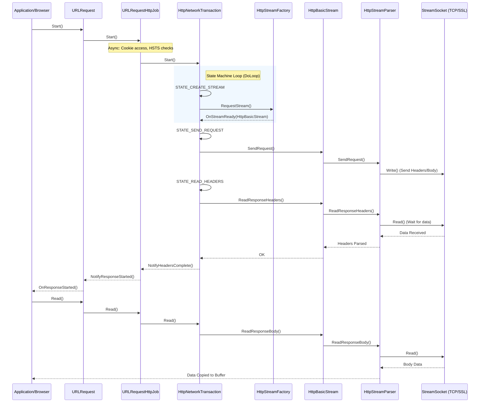

# Chromium HTTP Execution Flow Trace

This document traces the complete execution flow of an HTTP request in Chromium, starting from `URLRequest::Start()` and ending when data is read from the socket.

## 1. High-Level Sequence Diagram

## 2. Detailed Execution Flow

### Step 1: Request Initiation
*   **Method**: `URLRequest::Start()`
*   **File**: `net/url_request/url_request.cc`
*   **Action**: 
    1. Checks if the delegate is blocked.
    2. Calls `job_factory()->CreateJob(this)` (creates `URLRequestHttpJob`).
    3. Calls `job_->Start()`.

### Step 2: Job Setup & Transaction Creation
*   **Method**: `URLRequestHttpJob::Start()`
*   **File**: `net/url_request/url_request_http_job.cc`
*   **Action**:
    1. **Async Decision**: Checks cookies, First-Party Sets, and HSTS upgrades.
    2. Calls `StartTransactionInternal()`.
    3. Creates `HttpNetworkTransaction` via `http_transaction_factory()->CreateTransaction()`.
    4. Calls `transaction_->Start()`.

### Step 3: Transaction State Machine (Connection)
*   **Method**: `HttpNetworkTransaction::Start()`
*   **File**: `net/http/http_network_transaction.cc`
*   **Action**: Starts the `DoLoop`.
*   **Transition**: `STATE_CREATE_STREAM`.
*   **Method**: `DoCreateStream()`
    *   Calls `session_->http_stream_factory()->RequestStream(...)`.
*   **Async Breakpoint**: Returns `ERR_IO_PENDING`. Waits for `OnStreamReady` callback.

### Step 4: Stream Factory (Socket Pool)
*   **Method**: `HttpStreamFactory::RequestStream()`
*   **File**: `net/http/http_stream_factory.cc`
*   **Action**:
    1. Creates a `JobController` to manage the request.
    2. Races "Happy Eyeballs" (IPv4 vs IPv6, QUIC vs TCP).
    3. Requests a socket from `ClientSocketPool::RequestSocket()`.
    4. Once socket connects, creates `HttpBasicStream` (for HTTP/1.1) and calls delegate's `OnStreamReady`.

### Step 5: Sending Request
*   **Method**: `HttpNetworkTransaction::OnStreamReady()`
*   **File**: `net/http/http_network_transaction.cc`
*   **Action**: Resumes `DoLoop`.
*   **Transition**: `STATE_SEND_REQUEST`.
*   **Method**: `DoSendRequest()`
    *   `stream_->SendRequest(headers, ...)`

*   **Method**: `HttpBasicStream::SendRequest()`
    *   **File**: `net/http/http_basic_stream.cc`
    *   Delegates to `HttpStreamParser::SendRequest`.

*   **Method**: `HttpStreamParser::SendRequest()`
    *   **File**: `net/http/http_stream_parser.cc`
    *   Constructs raw HTTP request string.
    *   Calls `stream_socket_->Write()`.

### Step 6: Reading Response Headers
*   **Transition**: `STATE_READ_HEADERS` (in `HttpNetworkTransaction`).
*   **Method**: `DoReadHeaders()`
    *   `stream_->ReadResponseHeaders(...)`

*   **Method**: `HttpStreamParser::DoReadHeaders()`
    *   **File**: `net/http/http_stream_parser.cc`
    *   **Critical Async Step**: `stream_socket_->Read(read_buf_, ...)`
    *   Returns `ERR_IO_PENDING` while waiting for first byte.

### Step 7: Socket Data Received
1.  **OS/Network**: Bytes arrive on socket.
2.  **`StreamSocket`**: Calls callback passed to `Read`.
3.  **`HttpStreamParser::OnIOComplete`**:
    *   `DoReadHeadersComplete()` parses the raw bytes.
    *   If end of headers found, returns `OK` to `HttpBasicStream`.
4.  **`HttpNetworkTransaction`**:
    *   State moves to `STATE_READ_HEADERS_COMPLETE`.
    *   Invokes user callback `URLRequest::OnResponseStarted`.
5.  **`URLRequest::Read()`**:
    *   User calls Read to get body.
    *   Flows down to `HttpStreamParser::DoReadBody()`.
    *   Calls `stream_socket_->Read()`.

## 3. Key Decision Points & Async Operations

### Async Operations (Return `ERR_IO_PENDING`)
1.  **Cookie Access**: `URLRequestHttpJob` may wait for cookie jar lock.
2.  **DNS Resolution**: Inside `ClientSocketPool` / `HostResolver`.
3.  **TCP Connect**: Inside `ConnectJob`.
4.  **SSL Handshake**: Inside `SSLClientSocket`.
5.  **Sending Request**: If socket write blocks.
6.  **Reading Headers/Body**: Waiting for server response.

### Main Decision Points
*   **`URLRequestHttpJob::Start`**: Should we upgrade to HTTPS (HSTS)? Do we have cookies?
*   **`HttpStreamFactory`**: Should we use an existing idle socket? Should we race QUIC?
*   **`HttpNetworkTransaction::DoLoop`**: Are we authenticating? (401/407). Do we need to restart?
*   **`HttpStreamParser`**: Are headers complete? Is body chunked?
